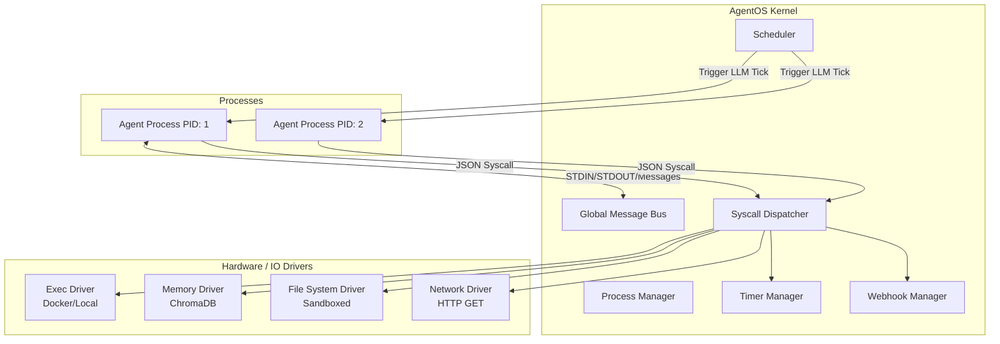
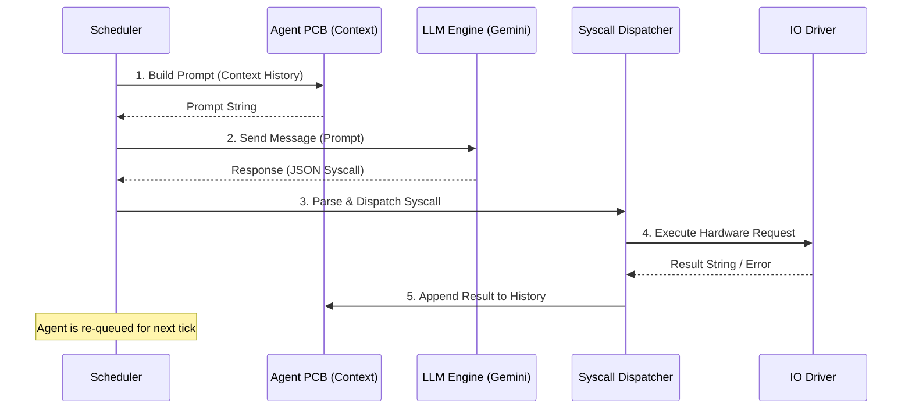

# AgentOS: Proof-of-Concept Architecture

AgentOS is a lightweight, Go-based operating system kernel designed specifically to run Large Language Models (LLMs) as independent, long-running processes. Instead of treating an LLM as a simple request-response API, AgentOS treats it as a CPU executing a continuous event loop, interacting with its environment through strict "syscalls."

---

## 1. High-Level Architecture

AgentOS mimics traditional OS architectures but replaces CPU threads with LLM Context Windows.

- **Process Manager**: Maintains a Process Control Block (`AgentPCB`) for every running agent, tracking its PID, state, memory pointers, and IO buffers.
- **Scheduler**: A background loop that continuously evaluates process states. If an agent is `StatusRunning`, the scheduler builds its prompt history and triggers the LLM.
- **Syscall Dispatcher**: The central bridge between the LLM's text output and actual machine execution. It parses JSON commands from the LLM and routes them to hardware drivers.
- **Hardware Drivers**: Safely wrapped interfaces to the host system (Docker, Local File System, Network, Vector Databases).

### Architecture Diagram

---

## 2. Core Data Flow

An agent operates on a continuous tick cycle managed by the `Scheduler`.

### Execution Loop Sequence

1. **Context Building**: The `ContextManager` gathers the agent's system instructions, role, and recent chronological history (IPC messages, webhook hits, previous syscall results).
2. **LLM Inference**: The prompt is sent to the LLM (e.g., `gemini-1.5-flash`). The LLM generates text and must include a formatted `[SYS_CALL::...]` JSON block.
3. **Dispatch**: The OS parses the JSON. If the syntax is invalid, a structured error is appended to the context. If valid, it is routed to the corresponding handler.
4. **Execution**: The handler talks to a Driver or an internal OS component (like the Message Bus).
5. **State Update**: The result (e.g., stdout, HTTP response body) is injected back into the agent's Context History, and the loop repeats.

---

## 3. Process Management & State

Every agent is represented by an `AgentPCB` (Process Control Block).
- **PID**: Unique integer ID.
- **Status**: 
  - `RUNNING`: Ready to be ticked by the scheduler.
  - `SLEEPING`: Yielded execution (e.g., `SYS_SCHEDULE` or `SLEEP`).
  - `TERMINATED`: Process killed (e.g., `SYS_EXIT` or `aos kill`).
- **Permissions**: RBAC list defining which syscalls the agent is authorized to use.
- **IO Buffers**: Internal `Stdin` and `Stdout` channels.

---

## 4. Syscall Reference

Agents interact with the world strictly through Syscalls.

### Execution & Lifecycle
* `[SYS_CALL::SPAWN_AGENT] {"model": "gemini-1.5-flash", "role": "prompt", "permissions": ["SYS_WRITE_STDOUT"], "pipe_to": 3}`
  - Forks a child process. You can restrict its capabilities using `permissions` and route its output using `pipe_to`.
* `[SYS_CALL::EXEC_CMD] {"cmd": "ls -la"}`
  - Executes a bash/powershell command via Docker (or local fallback).
* `[SYS_CALL::SYS_EXIT] {}`
  - Cleanly terminates the agent and halts its execution loop.

### File System (Sandboxed)
* `[SYS_CALL::FS_READ] {"path": "/test.txt"}`
  - Reads a file. Paths are jailed to `d:\AgentOS\workspace`.
* `[SYS_CALL::FS_WRITE] {"path": "/test.txt", "content": "hello"}`
  - Writes to a file inside the sandbox.

### Network
* `[SYS_CALL::NET_FETCH] {"url": "https://example.com"}`
  - Performs an HTTP GET request. Payload is capped at 5MB, and timeouts are enforced.

### Memory (Vector Database)
* `[SYS_CALL::MEM_WRITE] {"key": "label", "value": "text"}`
  - Embeds and stores knowledge in ChromaDB.
* `[SYS_CALL::MEM_READ] {"query": "search term"}`
  - Semantic search retrieval from ChromaDB.

### Inter-Process Communication (IPC)
* `[SYS_CALL::SEND_MSG] {"to_pid": 2, "content": "hello"}`
  - Asynchronous point-to-point message routing via the Global Message Bus.
* `[SYS_CALL::RECV_MSG] {}`
  - Dequeues pending messages from the agent's inbox.
* `[SYS_CALL::SYS_WRITE_STDOUT] {"text": "hello"}`
  - Pushes text to STDOUT. If `pipe_to` was configured on spawn, this injects directly into the target's STDIN.
* `[SYS_CALL::SYS_READ_STDIN] {}`
  - Pops the next item from the agent's STDIN buffer.

### Timers & Async Events
* `[SYS_CALL::SLEEP] {"seconds": 5}`
  - Synchronous block. Agent stops ticking for N seconds.
* `[SYS_CALL::SYS_SCHEDULE] {"seconds": 60, "prompt": "Wake up"}`
  - Registers a background timer. The OS will inject the `prompt` into context and wake the agent in N seconds.

### Webhooks
* `[SYS_CALL::SYS_REGISTER_WEBHOOK] {"path": "/api/webhook"}`
  - Binds the agent to a URL on the local `8088` server.
* `[SYS_CALL::SYS_WEBHOOK_REPLY] {"request_id": "123", "status": 200, "body": "OK"}`
  - Resolves a pending HTTP request with a dynamic response.

---

## 5. Security & Isolation

AgentOS implements multiple layers of defense:
1. **RBAC (Role-Based Access Control)**: Child agents can be spawned with least-privilege principles, preventing them from accessing disks or networks.
2. **Path Jailing**: The `LocalFSDriver` strips absolute path traversal (`../`) and locks all operations into the `/workspace/` directory.
3. **Network Constraints**: The `LocalNetDriver` is locked to `GET` requests to prevent state mutation on external servers.
4. **Structured Error Recovery**: When LLMs hallucinate invalid JSON structures, the OS catches the Go struct decoding error and injects a helpful schema validation message back into context, allowing the LLM to self-correct on the next tick.

---

## 6. Command Line Interface

Compiled via Cobra into `aos.exe`:
- `.\aos spawn --model "gemini-1.5-flash" --role "You are an assistant"`: Starts the OS and boots the root process.
- `.\aos ps`: Lists all active processes and their PIDs.
- `.\aos top`: Shows real-time telemetry (tokens consumed, syscalls executed).
- `.\aos logs [PID]`: Streams the live thought-process and stdout of a specific agent.
- `.\aos kill [PID]`: Sends a SIGTERM equivalent to forcefully terminate an agent.
